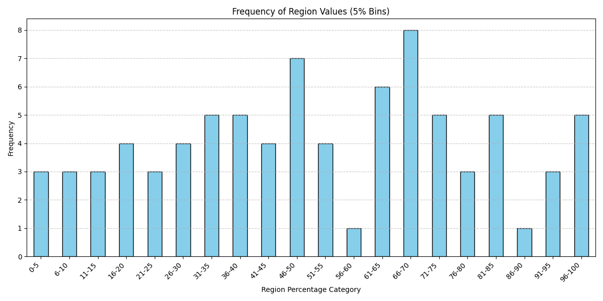
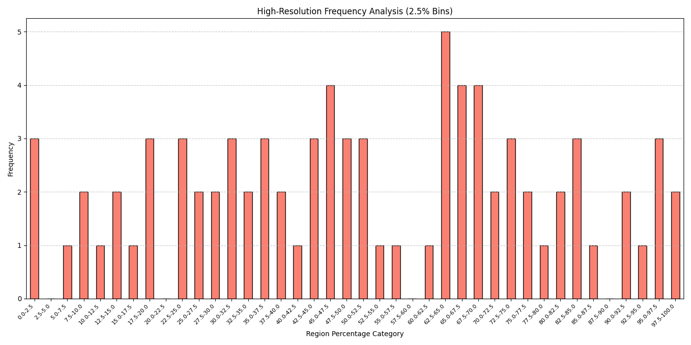

# Keys: Statistical Analysis of solved Bitcoin Puzzles

## Overview

This directory contains the dataset and statistical analysis for the solved keys of the **Bitcoin Puzzle Challenge** (bit-ranges #1 through #130). The project focuses on visualizing the relative distribution of these keys within their respective mathematical boundaries to identify potential non-random patterns or algorithmic biases.

## Dataset Structure (`data4.csv`)

The dataset comprises 82 solved keys mapped to their bit-ranges. 

| Column | Description |
| :--- | :--- |
| **index** | The bit-size $N$ of the puzzle range $[2^{N-1}, 2^N - 1]$. |
| **start** | The hexadecimal lower bound of the range ($2^{N-1}$). |
| **end** | The hexadecimal upper bound of the range ($2^N - 1$). |
| **key** | The hexadecimal private key that solves the puzzle. |
| **region** | The percentage position of the `key` within the range $[start, end]$. |

### The "Region" Metric
The `region` value is the core of this statistical study. It determines where a key falls relative to its range:
$$Region(\%) = \frac{Key - Start}{End - Start} \times 100$$
A value of $0\%$ means the key is at the absolute floor of the bit-range, while $100\%$ means it is at the ceiling.

## Statistical Visualization

The included Jupyter Notebook (`keys.ipynb`) processes the raw hex data and generates frequency distribution plots to visualize the spatial density of solved keys.

### 1. 5% Step Frequency Distribution
This plot categorizes keys into 20 bins (each representing a 5% width of the bit-range).



**Plot Explanation:**
- **X-Axis (Region Percentage Category):** Represents the percentage offset from the start of the bit-range (0% to 100%).
- **Y-Axis (Frequency):** Shows the count of solved keys falling into each 5% bucket.
- **Visual Pattern:** The plot typicaly reveals a non-uniform distribution. A notable observation is the peak in the **66-70%** region, suggesting that a statistically significant number of puzzle keys cluster in this specific percentile of their ranges.

### 2. High-Resolution (2.5% Step) Analysis
By increasing the resolution to 40 bins (2.5% steps), the analysis reveals finer clusters.



**Plot Explanation:**
- **Granularity:** This refined plot breaks down the data into 2.5% increments, allowing for the detection of "micro-clusters."
- **Insight:** By looking at categories like **0-2.5%** vs. **97.6-100%**, researchers can determine if keys are being generated near the "boundaries" of the bit-ranges, which would be a strong indicator of low-entropy generation seeds.
- **Trend Analysis:** The bar chart highlights whether the distribution is "Gaussian-like" (random) or "Spiky" (algorithmic), which informs the seed-searching strategy in the Seeds Master project.

## Notebook Logic Deep-Dive

The `keys.ipynb` workflow implements:
1.  **Hex-to-Int Handling**: Since Bitcoin keys exceed standard 64-bit integer limits, the notebook uses Python's arbitrary-precision integers and Pandas `object` dtypes to prevent overflow.
2.  **Binning & Categorization**: Using `pd.cut()` to segment the continuous `region` percentages into discrete statistical buckets.
3.  **Visualization**: Utilizing `matplotlib.pyplot` to render bar charts that highlight the frequency of solved keys in specific percentage "zones."

## How to execute the analysis

Ensure you have the required dependencies:
```bash
pip install pandas matplotlib
```

Run the notebook using:
```bash
jupyter notebook keys.ipynb
```
The script will automatically read `data4.csv`, normalize the keys, and update the frequency plots.
